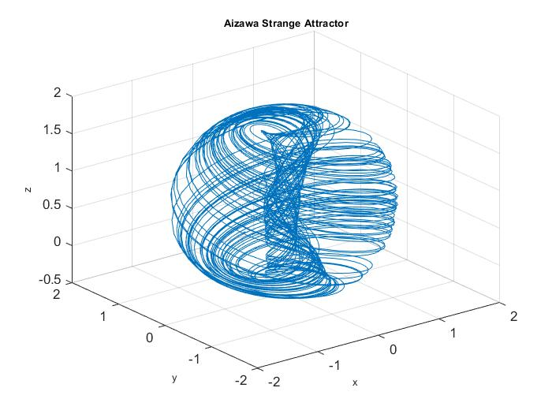
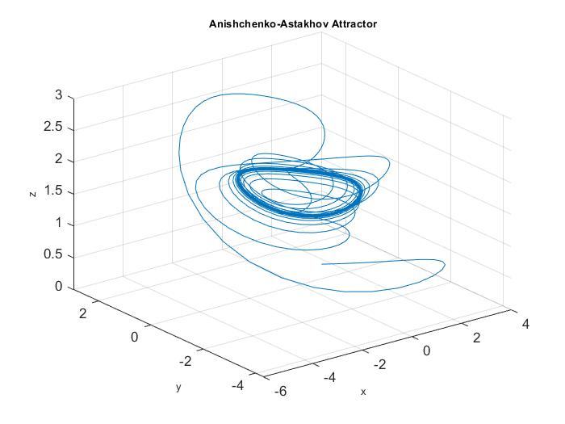

# Strange-Attractors
Phase portraite of caotic attractors
### Aizawa

<figure>

</figure>

### Anishchenko-Astakhov

<figure>

</figure>

### Arneodo

<figure>

</figure>

### 

<figure>

</figure>

### Burke

<figure>

</figure>

### Chen-Celikovsky

<figure>

</figure>

### Chen-Lee

<figure>

</figure>

### Chua

<figure>

</figure>

### Chua Hidden

<figure>

</figure>

### Coullet

<figure>

</figure>

### Dadras

<figure>

</figure>

### 

<figure>

</figure>

### Finance

<figure>

</figure>

### Four-Wing

<figure>

</figure>

### Genesio-Tesi

<figure>

</figure>

### Hadley

<figure>

</figure>

### Halvorsen

<figure>

</figure>

### 

<figure>

</figure>

### 

<figure>

</figure>

### Liu-Chen

<figure>

</figure>

### Lu-Chen

<figure>

</figure>

### 

<figure>

</figure>

### Newton-Leipnik

<figure>

</figure>

### Nose-Hoover

<figure>

</figure>

### Qi

<figure>

</figure>

### Qi-Chen

<figure>

</figure>

### Rabinovich-Fabrikant

<figure>

</figure>

### Rayleigh-Benard

<figure>

</figure>

### Rossler

<figure>

</figure>

### Rucklidge

<figure>

</figure>

### Sakarya

<figure>

</figure>

### Shimizu-Morioka

<figure>

</figure>

### Sprott

<figure>

</figure>

### Lorenz-Stenflo

<figure>

</figure>

### Thomas

<figure>

</figure>

### 

<figure>

</figure>

### Wang-Sun

<figure>

</figure>

### Wimol-Banlue

<figure>

</figure>

### Yu-Wang

<figure>

</figure>

ل
<figure>

<figcaption aria-hidden="true"> </figcaption>
</figure>

<figure>

<figcaption aria-hidden="true"> </figcaption>
</figure>

<figure>

<figcaption aria-hidden="true"> </figcaption>
</figure>

<figure>

<figcaption aria-hidden="true"> </figcaption>
</figure>

<figure>

<figcaption aria-hidden="true"> </figcaption>
</figure>

## 

<figure>

</figure>

   

## 

<figure>

<figcaption aria-hidden="true"> </figcaption>
</figure>

# 

<figure>

</figure>
